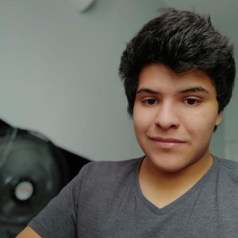
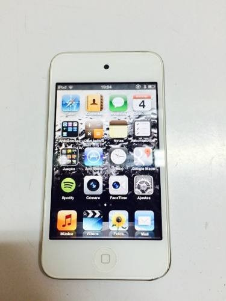
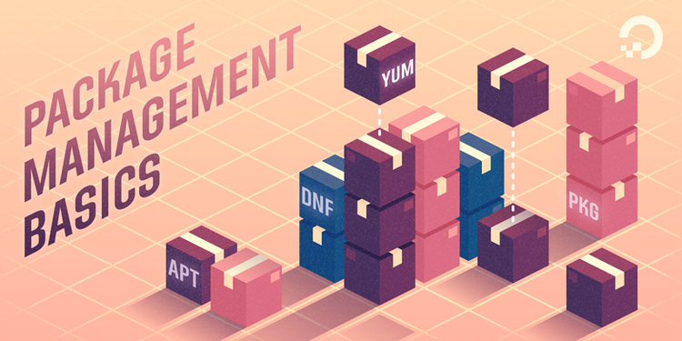
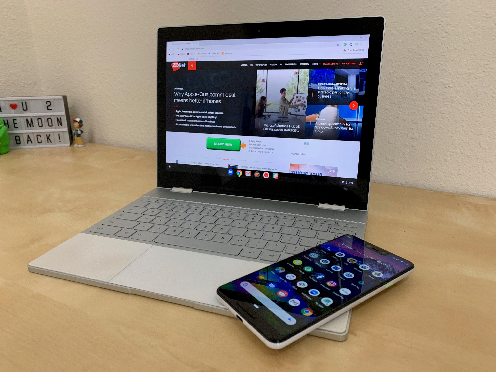

# Hey there, Im Diego Magdaleno 👋🏼👨🏽‍💻

 Hi, Im Diego Magdaleno, a young software developer that loves Open Source when the result is better than the current closed source alternatives. I love creating solutions to problems that make my daily life harder, so others don't have to experience the same struggle.

I like to make everything professional and flexible, even simple scripts.

Here you can find my story, interests, what I am learning, and some fun facts about me.

### 🙃 How I started programming

I got interested in programming because I had an old iPod 4 that was given to me for only 40 dollars, when iOS 7 came out I loved the new cartoony/flat design, I was around the age of 10.  But the iPod 4 didn't support iOS 7, and this got me into a Jailbreaking just so I could install Winterboard and an iOS 7 theme, my interest in how those things were made started, so I started to learning the magic of programming, starting with Scratch.

A few years later when I was around 13 or 14, I got a Lenovo laptop that had this weird bug where it would type "zyzyzyzy" out of nowhere, after my dad tried to fix it by giving it to a lot of technicians, and them saying it wasn't a hardware problem but an unremovable virus, I had an idea. So that day I installed Linux which got me into Bash scripting. _Fun fact: Days later I dual booted Windows, and the issue was gone, I wonder how did they restored that thing, it worked for me first try without the "zyzyzyzyzyz" issue_

Today programming is not only my hobby but a passion, and all thanks to having that old iPod and laptop, today this is no longer an issue for me but thank God I had old hardware, no one knows where I would be now, probably taking photos on Snapchat wondering what kind of magic that is.

### 🔬 My primary interests

I have a lot of interests in programming, but here are some things I love a lot and I'm currently working on:

- **Package Management:** I love working with package managers. Package managers are a thing that should be universal (Looking at your Microsoft). They allow us to get things instantly just by running a command, I have put a lot of time into this previously and contributed to various projects, just to name a few:
  
  -  Novus: Novus was a brew frontend for macOS, similar to what you see in iOS with Cydia or Sileo (APT Frontends). It started back in 2018 with a few friends, however this project failed, it was my first project and my experience was very low to guide it to success.

      Back in 2019, 1 year after the initial failure, my best friend SmushyTaco and I revived Novus, using pacman (Yes the Arch Linux package manager). After having    some trouble with the repos, we switched to APT (By Debian) and since the ecosystem was already used on iOS, I had some incredible team members like Diatrus (That helped me a lot with APT, patching the bootstrap, etc), Ultra and EvenDev (That made most of the GUI), and SmushyTaco (That contributed many ideas and rewrote a good deal of stuff in Rust) 
    
    
    
  - I contributed to Spack, recently it is in fact a package manager that I love, sadly is broken on current macOS versions, my contributions range from better behaviour when running as root to adding some packages.
  
  - I have contributed a few packages to Brew, and I maintain my own Brew repo, I love the scripting power Ruby has, but I wish it was a little faster.
  
- **Core utilities:** While I love the concept of free software, I think if we as developers decide to not provide the source of a certain application/program/service then we should be able to do so, but this isn't a thing in the GPL license, therefore another one of my interests as an open source lover, is to port and update many BSD utilities to multiple UNIX operating systems, you can find those projects here in my GitHub.

- **Build systems:** Back when Novus was a thing (Since it failed) the main repo was named "Project Serna", it was amazing, however, there was a problem, compiling software manually was a pain, I was interested on how Brew, Debian, etc. could maintain all this software, and it's when I discovered automated build systems, a concept I think should be implemented and I dream some day with having this universally implemented, I love the idea of having a build system, that you could drop technically anything and it will compile it, so a package manager can later install it. I still work on this idea, a long with package management.

- **Making computers more intuitive:** I believe that some operations we as "power users" or developers do shouldn't be exclusive, therefore im interested into making "complex" things easier, in fact, I am working on many projects (Classic developer with 100000 unfinished projects) to make for example something as simple as file hierarchy more intuitive and easy to use, and I hope I have something of this in the future.

- **Unified UIs and Experiences:** I cannot stress this enough, but I feel like all devices should feel like one in different form factors, in fact im an Apple user because of the ecosystem, I think we should be able to perform the same operations on either devices with a similar experience in the UI, therefore as you might have guess, based on my previous work, I absolutely love the Apple ecosystem. 
  
  And I would love seeing something by Google similar to this ecosystem in their Chromebooks and Android devices, or KDE with KDE mobile, or even GNOME! This is one of my favorite things in computing, so you will normally see an attempt of my own to make my software run everywhere. 
  
- **UNIX:** I love UNIX-like operating systems, in fact, who doesn't?, so im interested in porting software from one UNIX platform to another, normally this is easy, unless the software depends on GNU syscalls, you can tell I don't like gnulibc, but I love writing software that works the same or very similar in all *NIX operating systems! Therefore my software normally works in both macOS and Linux, and since macOS is BSD-like it also works on BSD, sometimes, when the planets align, it works on Windows.

### 🔭 I’m working on

I have a couple of projects I have been working on, some for a while, some for a little time and something I want to work in:

- **Winter (Codename):** Winter is a package manager (How unexpected!) written in Rust, and it introduces new features to the world of package management, like native payment APIs or donation APIs, new algorithms for dependency solving, and more! Creating a package manager from scratch is a lot of work, so I don't expect this to be done any time soon.

- **QuickStart!:** I hate, with all my heart, making READMEs. I wish I could have a template and just drop my information, this is where QuickStart comes in. QuickStart is a new project of mine with a UI made in React and  backend in Golang, the plan is to make starting GitHub projects that look good, super easy! 

- **Kanji:** Kanji is a build system written in Python that allows compilation of a lot of open source software, with a "formulae" similar to Brew, the plan is to have a system that can output the same (or similar) package to multiple *NIX operating systems. 

- **Cheemit!:** I love Cheems, Cheems is a silly funny yellow dog, so I made a tool that puts him in images, Im working on adding more features to it, and I am having a lot of fun naming variables like `whereDoesCheemsGo`.

- **EzChRoot:** chroots are essential when one is making a build system (You know, you don't want to delete /etc/ on your main system on accident), so so I made EzChRoot, since all where bash scripts, and allowed very little reusability or configuration I wrote my own tool on Golang, sadly the code isn't very good and it is broken on Big Sur.

- **trm:** This project is simple, in fact it was suggested by a friend, it's basically `rm` but instead of deleting files it moves them to the trash, and you might wonder "Why not just make an alias to mv?" and you would be 100% right, I only made it for fun and a suggestion.

 ### 🌱 I’m learning:
 
 - **React:** I don't enjoy frontend development a lot, but I found this framework interesting, so I started learning it with the help of some free resources of the internet, since im new to this crazy GUI world, when someone mentions the word "view" my heart skips a beat.
 
 - **Flutter:** Im learning Flutter after I finish React since I find this project a little bit interesting but I want to learn more interesting stuff like...
 
 - **Swift UI:** I want to learn Swift so I can make a GUI for many of my tools or future projects, we'll see how that turns out.
